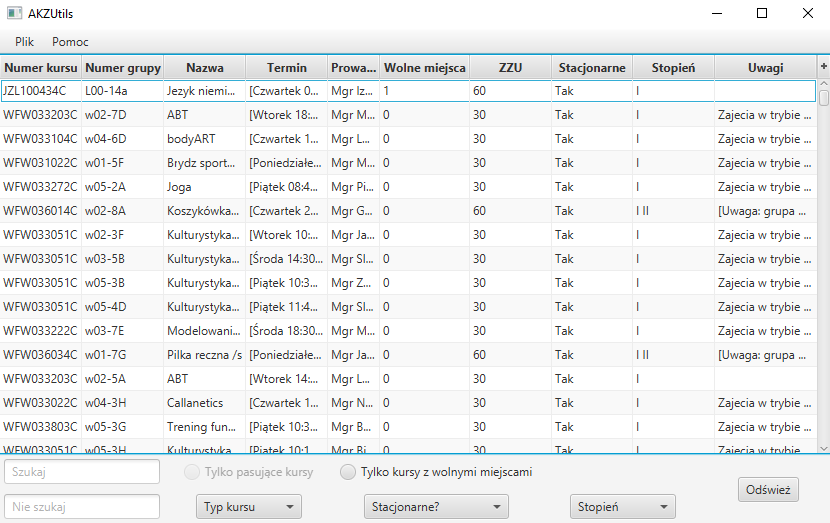

[![Contributors][contributors-shield]][contributors-url]
[![Forks][forks-shield]][forks-url]
[![Stargazers][stars-shield]][stars-url]
[![Issues][issues-shield]][issues-url]
[![MIT License][license-shield]][license-url]
[![LinkedIn][linkedin-shield]][linkedin-url]


<br />
<p align="center">
  <h3 align="center">AkzUtils</h3>

  <p align="center">
    The project is an attempt at making browsin and searching for interesting courses from <a href="http://akz.pwr.edu.pl/">Aktualny Katalog Zapisowy PWr</a> easier and faster.
    <br />
    <a href="https://github.com/simonusher/akzUtils/issues">Report Bug</a>
    ·
    <a href="https://github.com/simonusher/akzUtils/issues">Request Feature</a>
  </p>
</p>

<details open="open">
  <summary><h2 style="display: inline-block">Table of Contents</h2></summary>
  <ol>
    <li>
      <a href="#about-the-project">About The Project</a>
      <ul>
        <li><a href="#built-with">Built With</a></li>
      </ul>
    </li>
    <li>
      <a href="#getting-started">Getting Started</a>
      <ul>
        <li><a href="#prerequisites">Prerequisites</a></li>
        <li><a href="#installation">Installation</a></li>
      </ul>
    </li>
    <li><a href="#usage">Usage</a></li>
    <li><a href="#project-status">Project status</a></li>
    <li><a href="#contributing">Contributing</a></li>
    <li><a href="#license">License</a></li>
    <li><a href="#contact">Contact</a></li>
  </ol>
</details>


<!-- ABOUT THE PROJECT -->
## About The Project

<p align="center"></p>

The project attempts to simplify browsing PWr's AKZ course catalog. The program was written in Java and JavaFX utilizing jsoup library for parsing. It adds additional filters select courses, and an ability to load your timetable and show only courses that match it.


### Built With

* Java,
* [JavaFX](https://openjfx.io/),
* [jsoup](https://jsoup.org/).


## Getting Started

To get the program running follow these steps.

### Prerequisites

You need a Java SDK installation. The build was tested using AdoptOpenJDK 1.15.0-1. You can download it [here](https://adoptopenjdk.net/) but I suggest using an SDK manager such as [SDKMAN!](https://sdkman.io/) or [jabba](https://github.com/shyiko/jabba).

### Installation

1. Clone the akzUtils
   ```sh
   git clone https://github.com/simonusher/akzUtils.git
   ```
2. Import it as a Gradle project - for example with IntelliJ.
3. Build it with gradle.


## Usage

This program can be used to browse [Aktualny Katalog Zapisowy](http://akz.pwr.edu.pl/) easier than on the official website. The main features that make it possible are:
- additional filters such as "courses with places available", "studies degree" or "course type",
- ability to load your timetable either from JSOS website or from HTML, and then show only courses that don't collide with it.


## Project status

The project is not under active maintenance. However, If you wish to improve it in any way I would suggest to add handling of courses with multiple dates.


## Contributing

Feel free to contribute to the project if you wish. Any upgrade or improvement, either adding a feature or improving the code is **greatly appreciated**.

1. Fork the Project
2. Create your Feature Branch (`git checkout -b new-feature`)
3. Commit your Changes (`git commit -m 'add some new feature'`)
4. Push to the Branch (`git push origin new-feature`)
5. Open a Pull Request


## License

Distributed under the MIT License. See `LICENSE` for more information.

## Contact

Szymon Woźniak - swozniak6@gmail.com

Project Link: [https://github.com/simonusher/akzUtils](https://github.com/simonusher/akzUtils)


<!-- MARKDOWN LINKS & IMAGES -->
<!-- https://www.markdownguide.org/basic-syntax/#reference-style-links -->
[contributors-shield]: https://img.shields.io/github/contributors/simonusher/akzUtils.svg?style=for-the-badge
[contributors-url]: https://github.com/simonusher/akzUtils/graphs/contributors
[forks-shield]: https://img.shields.io/github/forks/simonusher/akzUtils.svg?style=for-the-badge
[forks-url]: https://github.com/simonusher/akzUtils/network/members
[stars-shield]: https://img.shields.io/github/stars/simonusher/akzUtils.svg?style=for-the-badge
[stars-url]: https://github.com/simonusher/akzUtils/stargazers
[issues-shield]: https://img.shields.io/github/issues/simonusher/akzUtils.svg?style=for-the-badge
[issues-url]: https://github.com/simonusher/akzUtils/issues
[license-shield]: https://img.shields.io/github/license/simonusher/akzUtils.svg?style=for-the-badge
[license-url]: https://github.com/simonusher/akzUtils/blob/main/LICENSE.txt
[linkedin-shield]: https://img.shields.io/badge/-LinkedIn-black.svg?style=for-the-badge&logo=linkedin&colorB=555
[linkedin-url]: https://linkedin.com/in/simonusher